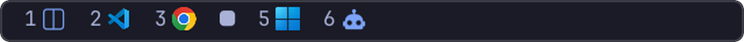
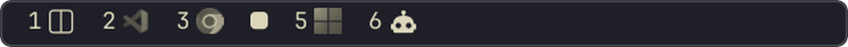
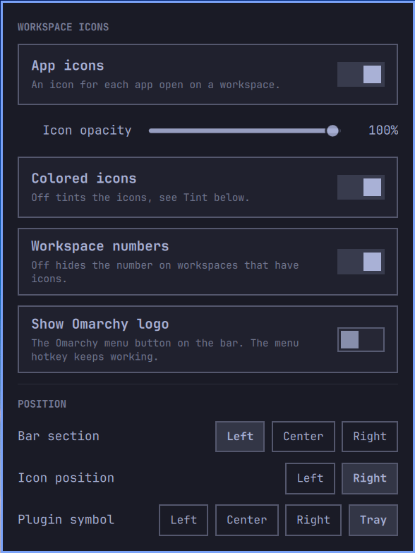

# Workspace Icons

**See what runs where.** Workspace Icons replaces Omarchy's workspace numbers
with numbers *and* the icons of the apps open on each workspace, so a glance at
the bar tells you that the editor is on 2, the browser on 3 and your terminals
on 1 and 6.

It follows your Omarchy theme, and everything is set from a small settings
popup. There's nothing to edit by hand.


## What it can do

- **App icons on every workspace.** One icon per app, next to the workspace
  number. Click a workspace to switch to it, just like the stock widget.
- **Knows what runs in your terminals.** A terminal running `nvim`, `btop`,
  `lazygit`, `claude` or `tmux` shows that program's icon, or a fitting glyph,
  instead of the terminal's.
- **Real icons for web apps.** Discord, WhatsApp, YouTube and other web apps
  get their own icon instead of the browser's.
- **Only uses icons already on your computer.** The plugin ships no logos; it
  finds icons in desktop entries, your icon theme, installed packages and the
  Nerd Font Omarchy includes.
- **Colored or theme-tinted icons.** Keep the apps' own colors, or tint every
  icon in your theme's **accent** color or its **normal** text color. Tints
  follow theme changes automatically, and the workspace numbers take the same
  color.
- **Highlight the focused workspace in color.** With tinted icons, the
  workspace you're on can show its icons in full color instead of the usual
  focus mark.
- **Numbers optional.** Hide the numbers on workspaces that have apps and let
  the icons speak. Put the icons left or right of the number.
- **Put it anywhere.** Move the widget to the bar's left, center or right
  section. Its settings button can sit in any section too, or hide in the
  system tray drawer behind the tray arrow.
- **Hide the Omarchy logo** on the bar if you don't use it. The Omarchy menu
  and its hotkey keep working.
- **Settings in one popup.** Click the settings button, right-click any
  workspace, or bind a hotkey. The popup also works with the keyboard, and in
  tray mode the same settings are in the tray icon's menu.

## Screenshots

**Tokyo Night:** colored app icons with numbers, the default. The terminals
on 1 and 6 show what runs in them: `herdr` (a terminal multiplexer) and
`claude` (an AI agent) get glyphs for their kind.



**Catppuccin Latte:** icons and numbers tinted in the theme's accent color.


**Gruvbox:** icons tinted in the theme's normal text color, numbers hidden on
workspaces with apps.


**Rosé Pine:** colored icons to the left of the numbers.


**Kanagawa:** accent tint.



**The settings popup** (Tokyo Night):



## Install

```bash
omarchy plugin add https://github.com/woodenplastic/omarchy-workspace-icons
```

Say yes to enabling it and pick a bar section. Workspace Icons **takes the
place of Omarchy's stock workspaces widget** automatically, in the same spot
and with its settings, so you never end up with two. Keybinds and scripts that
talk to `omarchy.workspaces` keep working and reach Workspace Icons instead.

## Settings

Open the settings by clicking the small grid button in front of the
workspaces, or by right-clicking any workspace.

| Setting | What it does |
|---|---|
| **App icons** | Show an icon for each app open on a workspace. |
| **Colored icons** | Show icons in their own colors. Turn off to tint them. |
| ↳ **Tint** | Shown while colored icons are off. **Accent** tints icons and numbers in the theme's accent color, **Normal** in its text color. |
| ↳ **Color the focused workspace** | Shown while colored icons are off. The focused workspace shows its icons in color instead of the focus mark. |
| **Workspace numbers** | Turn off to hide the number on workspaces that have icons. Empty workspaces keep their number. |
| **Show Omarchy logo** | Show or hide the Omarchy menu button on the bar. The menu hotkey keeps working. |
| **Bar section** | Left, center or right section of the bar. |
| **Icon position** | Icons left or right of the workspace number. |
| **Plugin symbol** | Where the settings button sits: left, center or right section of the bar, or **Tray**. |

Keyboard: arrow keys or `j`/`k` move between rows, `h`/`l` change a choice,
Enter toggles, Esc closes.

### Settings in the tray

With **Plugin symbol → Tray**, the settings button becomes a regular system
tray icon. It hides in the tray drawer behind the arrow like other tray icons,
and clicking it opens a standard tray menu with the same settings:
checkmarks for the switches, and sub-menus for Tint, Bar section, Icon
position and Plugin symbol. Omarchy's tray draws and places the menu, just like
for any other tray app.

A small helper (`scripts/tray-icon`) provides the tray icon and its menu. It
runs only while Tray is selected and stops with the shell.

### Hotkey

Open the settings from a key binding in `~/.config/hypr/bindings.lua`:

```lua
o.bind("SUPER + ALT + W", "Workspace Icons settings", "omarchy-shell woodenplastic.workspace-icons toggle")
```

### More options

A few rarely needed options have no switch in the popup. Set them on the
widget's entry in `~/.config/omarchy/shell.json`:

| Key | Default | What it does |
|---|---|---|
| `maxIcons` | `4` | Maximum icons per workspace (one per distinct app). |
| `showTerminalPrograms` | `true` | Show the program running in a terminal instead of the terminal icon. |
| `terminalPollSeconds` | `2` | How often to check what runs in terminals. |
| `iconOverrides` | `{}` | Window class or program name → icon name or absolute image path. |

Example:

```json
{
  "id": "woodenplastic.workspace-icons",
  "maxIcons": 3,
  "iconOverrides": {
    "xfreerdp": "windows",
    "MyTauriApp": "/home/me/projects/my-app/src-tauri/icons/128x128.png"
  }
}
```

Find a window's class with `hyprctl clients`.

## How icons are found

Workspace Icons **ships no app logos**. Every icon comes from what is already
installed on your computer, so it covers the apps you actually use:

1. **Your overrides:** `iconOverrides`, by window class or program name.
2. **Programs in terminals:** for terminal windows, the program in the
   terminal's foreground. It gets its own icon from its desktop entry, your
   icon theme, a launcher that opens it in a terminal (Omarchy's TUI entries,
   e.g. *Disk Usage* for `dua`), or the icons its package installed.
3. **Web apps:** browser app windows (Omarchy web apps, `--app=` windows)
   show the icon of the web app entry that launches that site, so Discord,
   WhatsApp or YouTube get their own icon instead of the browser's.
4. **Desktop apps:** the app's desktop entry, then your icon theme.
5. **Anything else installed:** `/usr/share/pixmaps` and the icons the
   owning package installed (looked up read-only with `pacman`).
6. **Nerd Font glyphs:** terminal programs with no icon anywhere get a glyph
   from the Nerd Font Omarchy installs. Tools that have one get their own
   (git, docker, node, python, rust, go, lua, ruby, vim, neovim, emacs,
   kubectl, pacman/yay/paru and more). Others get a glyph for their kind:
   a robot for AI agents like `claude` or `codex`, a gauge for system
   monitors, a folder for file managers, a split pane for `tmux`/`zellij`,
   and so on. The glyphs take your theme's accent color, or your tint.
7. A generic app icon, or the terminal icon for a plain shell.

To give an app or program a specific icon, map it in `iconOverrides`
(`"lazygit": "/path/to/lazygit.svg"`), or drop an SVG named after it into
`~/.local/share/icons/hicolor/scalable/apps/`.

## Requirements

- Omarchy with the Quickshell-based bar (`omarchy-shell`) on Hyprland.
- `hyprctl`, `jq`, `pacman` and JetBrainsMono Nerd Font, which Omarchy
  installs.
- For the **Tray** option only: the system Python (`/usr/bin/python3`) with
  PyGObject (`python-gobject`), which is part of every Omarchy install, and
  `hyprctl`.

No other packages are needed.

## What it changes

- On enable it replaces the `omarchy.workspaces` entry on the bar, and on
  disable or removal it puts that entry back. This is Omarchy's own
  replace-and-restore mechanism, declared with `"omarchy": {"clonedFrom":
  "omarchy.workspaces"}` in `manifest.json`.
- It writes only to `~/.config/omarchy/shell.json`, and only when you change a
  setting in the popup. It uses Omarchy's own config helper.
- **Show Omarchy logo** adds or removes the `omarchy.menu` entry on the bar.
- **Plugin symbol** in a bar section adds a second entry for this widget
  (`{"id": "woodenplastic.workspace-icons", "mode": "symbol"}`) that draws
  only the settings button.

## Uninstall

```bash
omarchy plugin remove woodenplastic.workspace-icons
```

Omarchy's stock workspaces widget comes back automatically in the same spot.
A settings button placed in its own bar section removes itself, and the tray
icon stops. `omarchy plugin disable woodenplastic.workspace-icons` does the
same while keeping the plugin installed, and enabling it again restores your
settings.

If you hid the Omarchy logo, bring it back with:

```bash
omarchy bar put omarchy.menu --section left --index 0
```

## Troubleshooting

- **An app shows a generic icon:** nothing on your system has an icon for it.
  Map it with `iconOverrides`.
- **A web app shows the browser icon:** it has no web app entry with its own
  icon. Omarchy's *Install Web App* creates one.
- **Vertical bar:** icons show on horizontal bars only; vertical bars show
  numbers.
- **A change doesn't show up:** run `omarchy restart shell`.

## License

MIT, see [LICENSE](LICENSE).
