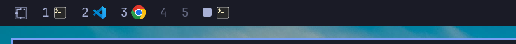

# Workspace Icons

An Omarchy bar widget that works like the built-in workspace indicators, but
also shows an icon for each app open on a workspace.



## Install

```bash
omarchy plugin add https://github.com/woodenplastic/omarchy-workspace-icons
```

Say yes to enabling it and pick a bar section (left, center or right). Then
remove the stock `omarchy.workspaces` widget so you don't have two:

```bash
omarchy plugin disable omarchy.workspaces
```

## Settings

Click the grid symbol in front of the workspaces (or right click any
workspace) to open the settings:

- **Show app icons**
- **Small icons**
- **Colored icons** (off tints the icons in the theme's accent color)
  - **Color the focused workspace** (shown while colored icons are off: the
    focused workspace shows its icons in color instead of the focus mark)
- **Show numbers** (off hides the number on workspaces that have icons)
- **Show Omarchy logo** (hides the Omarchy menu button on the bar; the menu
  hotkey keeps working)

And where things sit:

- **Bar section**: which section of the bar the widget sits in (left / center / right)
- **Icon position**: icons left or right of the workspace number
- **Grid symbol**: which section of the bar the grid symbol sits in. It starts
  in front of the workspaces; once moved, it is its own bar entry
  (`{"id": "woodenplastic.workspace-icons", "mode": "symbol"}`) and can sit in
  a different section from them

Arrow keys or `j`/`k` move between rows, `h`/`l` change a position, Enter toggles, Esc closes.

### Hotkey

Open the settings from a key binding in `~/.config/hypr/bindings.lua`:

```lua
o.bind("SUPER + ALT + W", "Workspace Icons settings", "omarchy-shell woodenplastic.workspace-icons toggle")
```

### More options

These are set inline on the widget's entry in `~/.config/omarchy/shell.json`:

| Key                    | Default | Description                                          |
|------------------------|---------|------------------------------------------------------|
| `maxIcons`             | `4`     | Maximum icons per workspace (one per distinct app).  |
| `showTerminalPrograms` | `true`  | Show the program running in a terminal instead of the terminal icon. |
| `terminalPollSeconds`  | `2`     | How often to check what runs in terminals.           |
| `iconOverrides`        | `{}`    | Window class or program name → icon name or absolute image path. |

Icons are looked up from the app's desktop entry, then the icon theme. Apps
without either show a generic icon; give them one with `iconOverrides`:

```json
{
  "id": "woodenplastic.workspace-icons",
  "maxIcons": 3,
  "iconOverrides": {
    "xfreerdp": "windows",
    "MyTauriApp": "/home/me/projects/my-app/src-tauri/icons/128x128.png"
  }
}
```

Find a window's class with `hyprctl clients`.

## Programs in terminals

For terminal windows (any app whose desktop entry is a `TerminalEmulator`), the
widget shows the program in the terminal's foreground, such as `nvim` or
`btop`. A plain shell keeps the terminal icon.

Programs are matched by process name. Programs without an icon in your theme
fall back to the terminal icon. Give them one either with `iconOverrides`
(`"claude": "/path/to/claude.svg"`), or by dropping an SVG named after the
program into `~/.local/share/icons/hicolor/scalable/apps/`, e.g.
`~/.local/share/icons/hicolor/scalable/apps/claude.svg`.

## Notes

- Chrome/Chromium web apps share the browser's window class, so they show the
  browser icon.
- Icons are shown on horizontal bars only; vertical bars show numbers.

## License

MIT
