# Workspace Icons

**See what runs where.** Workspace Icons replaces Omarchy's workspace numbers
with numbers *and* the icons of the apps open on each workspace, so a glance at
the bar tells you that the editor is on 2, the browser on 3 and your terminals
on 1 and 6.

It follows your Omarchy theme, and everything is set from a small settings
popup. There's nothing to edit by hand.

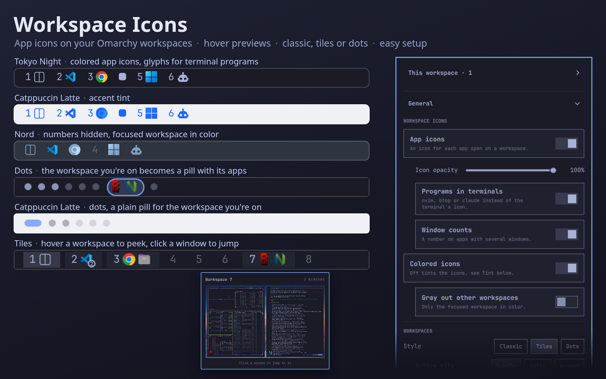

## What it can do

- **App icons on every workspace.** One icon per app, next to the workspace
  number, in the order the windows sit on screen. Click a workspace to switch
  to it, just like the stock widget.
- **Three styles.** **Classic** shows numbers with the app icons beside them.
  **Tiles** puts each workspace with windows on a soft rounded tile, the one
  you're on on a stronger one (subtle, solid or accent), with the focused
  window's app highlighted. **Dots** draws a small dot per workspace, bright with windows and dim when
  empty, and stretches the workspace you're on into a pill that carries its
  app icons, its number, both, or nothing, with or without a frame. A ring marks the workspace another monitor
  shows, special workspaces are squarer, and urgent ones pulse.
- **Click an icon to go to its window.** Left-click an app's icon to focus
  its window (again to cycle through its windows), middle-click to close it.
  An app with several windows on a workspace shows how many, and apps past
  the icon limit show as **+N**.
- **Knows what runs in your terminals.** A terminal running `nvim`, `btop`,
  `lazygit`, `claude` or `tmux` shows that program's icon, or a fitting glyph,
  instead of the terminal's.
- **Real icons for web apps and games.** Discord, WhatsApp, YouTube, HEY and
  other web apps get their own icon instead of the browser's, in Chromium,
  Chrome, Brave, Edge and Vivaldi. Steam games show their game icon, and
  Claude Code and Codex in a terminal show Omarchy's agent icons.
- **Only uses icons already on your computer.** The plugin ships no logos; it
  finds icons in desktop entries, your icon theme, installed packages and the
  Nerd Font Omarchy includes.
- **Colored or theme-tinted icons.** Keep the apps' own colors, or tint every
  icon in your theme's **accent** color or its **normal** text color. Tints
  follow theme changes automatically, and the workspace numbers take the same
  color.
- **Highlight the focused workspace in color.** With tinted icons, the
  workspace you're on can show its icons in full color instead of the usual
  focus mark. With colored icons, the other workspaces can go gray instead.
- **Adjustable icon opacity.** Fade the icons with a slider to keep the bar
  calm, while the numbers stay fully visible.
- **Peek before you jump.** Rest the pointer on a workspace to see a
  miniature of it over your wallpaper: its windows where they sit on the
  monitor, captured from the windows themselves, each with its app's icon in
  the corner. Hover an app's icon on the bar to mark its windows, click a
  window in the preview to jump to it. Optionally live, and
  hidden while you share or record your screen.
- **Urgent windows stand out.** A workspace whose app wants attention pulses
  in the bar's urgent color, with a dot on that app's icon.
- **Scroll to switch.** The mouse wheel over the workspaces moves between
  them; trackpads switch one workspace per notch, not in bursts.
- **Name your workspaces.** Right-click a workspace and type a name, or an
  emoji or glyph, to show instead of its number.
- **Special and named workspaces.** The scratchpad and other special
  workspaces show while they hold windows, marked while open; click to toggle.
  Named Hyprland workspaces show by name.
- **Multi-monitor aware.** Each bar marks the workspace its own monitor
  shows. Optionally each bar lists only its monitor's workspaces, and a click
  can bring a workspace to the monitor you clicked on.
- **Vertical bars too.** On a left or right bar the icons stack under the
  number.
- **As many workspaces as you use.** Choose how many workspaces the bar
  always shows, from 1 to 10, even when they're empty, or hide empty ones.
  Workspaces with windows past that number show up too, up to 99.
- **Numbers optional.** Hide the numbers on workspaces that have apps and let
  the icons speak. Put the icons left or right of the number.
- **Put it anywhere.** Move the widget to the bar's left, center or right
  section. Its settings button can sit in any section too, or hide in the
  system tray drawer behind the tray arrow.
- **Hide the Omarchy logo** on the bar if you don't use it. The Omarchy menu
  and its hotkey keep working.
- **Settings in one popup.** Click the settings button, right-click any
  workspace, or bind a hotkey. The popup also works with the keyboard. Every
  setting can also be set with `omarchy bar set`.
- **Light on the system.** It follows Hyprland's events instead of polling,
  and polls only for what runs in terminals, while there are terminals.

## Screenshots

**Tokyo Night:** colored app icons with numbers, the default. The terminals
on 1 and 6 show what runs in them: `herdr` (a terminal multiplexer) and
`claude` (an AI agent) get glyphs for their kind.

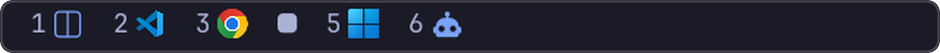

**Catppuccin Latte:** icons and numbers tinted in the theme's accent color.


**Nord:** numbers hidden on workspaces with apps, and the focused workspace
(2) shows its icon in full color among the tinted ones.

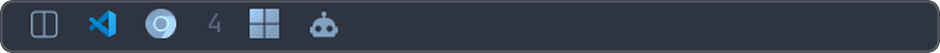

**Gruvbox:** icons tinted in the theme's normal text color, numbers hidden on
workspaces with apps.

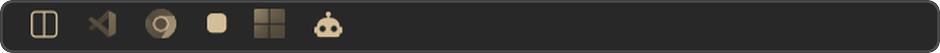

**Rosé Pine:** colored icons to the left of the numbers.


**Kanagawa:** accent tint.

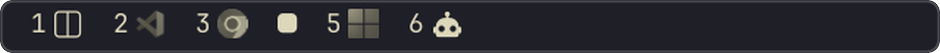

**Tiles style** (Tokyo Night), with the **Subtle** active tile:

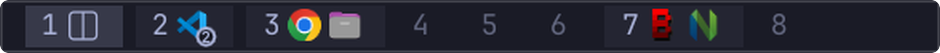

**Dots style** (Tokyo Night): a dot per workspace, and the one you're on
(7, with `btop` and `nvim`) a pill carrying its apps.

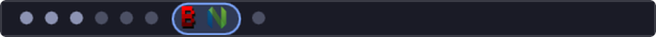

With tinted icons the pill is solid and can carry the number too; with the
pill frame off the apps sit on the bar itself.

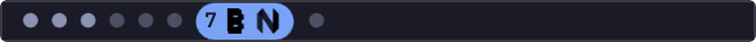

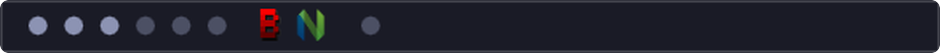

**Catppuccin Latte, dots:** with **Focused pill → None**, a plain pill marks
the workspace you're on.

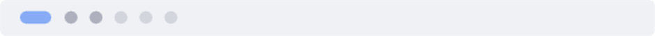

**Tiles style and the workspace preview** (Tokyo Night): workspaces with
windows sit on tiles, the one you're on (1) on a brighter one. Resting the
pointer on workspace 7 shows its two terminals, `btop` and `nvim`, where they
sit on the monitor; click one to jump to it. The bar is set to show 8
workspaces, so the empty ones stay visible too.

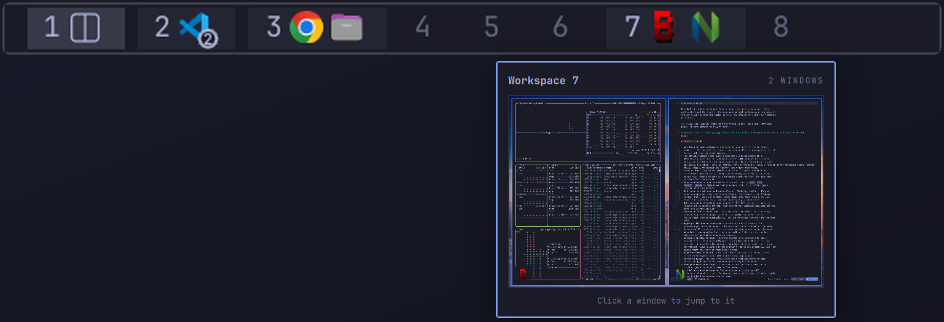

**The settings popup** (Tokyo Night), opened from the settings button: the
**General** section, with **This workspace** folded above it.

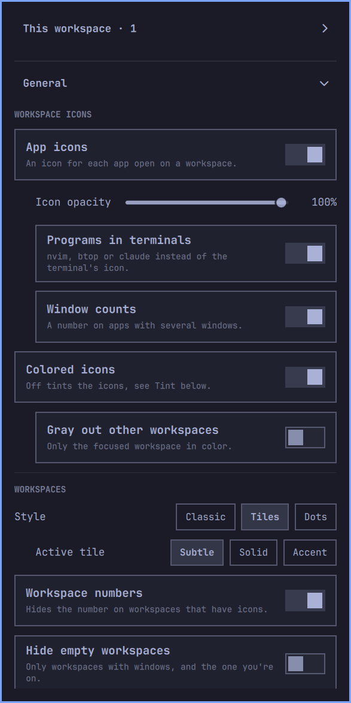

Right-clicking workspace 3 opens it on that workspace's own settings, here
with the name "web".

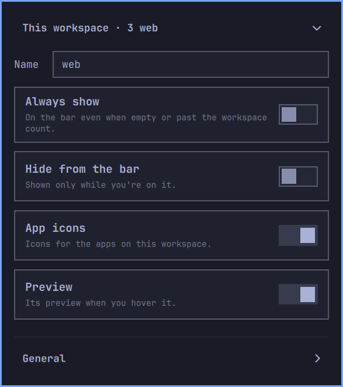

## Install

```bash
omarchy plugin add https://github.com/woodenplastic/omarchy-workspace-icons
```

Say yes to enabling it and pick a bar section. Workspace Icons **takes the
place of Omarchy's stock workspaces widget** automatically, in the same spot
and with its settings, so you never end up with two. Keybinds and scripts that
talk to `omarchy.workspaces` keep working and reach Workspace Icons instead.

## Settings

Open the settings by clicking the small grid button in front of the
workspaces, or by right-clicking any workspace.

The popup has two sections that fold open and closed: **This workspace**,
with the settings of one workspace, and **General**, with everything else.
Right-clicking a workspace opens the popup on that workspace's section; the
settings button, the tray icon and the hotkey open it on **General**, where
**This workspace** is the one you're on.

**This workspace**

| Setting | What it does |
|---|---|
| **Name** | Shown instead of the workspace's number; a word, an emoji or a glyph. Press Enter to save, clear it for the number. |
| **Always show** | Keep the workspace on the bar even when it's empty or past **Workspaces shown**. |
| **Hide from the bar** | Show the workspace only while you're on it. |
| **App icons** | Show the icons of the apps on this workspace. |
| **Preview** | Show this workspace's preview when you hover it, e.g. off for a private one. |

**General** has four parts.

| Setting | What it does |
|---|---|
| **Workspace icons** | |
| **App icons** | Show an icon for each app open on a workspace. |
| ↳ **Icon opacity** | Slider from 20 % to 100 %. Fades the icons; the numbers stay opaque. |
| ↳ **Programs in terminals** | Show the program running in a terminal (`nvim`, `btop`, `claude`) instead of the terminal's icon. |
| ↳ **Window counts** | A small number on apps with several windows on the workspace. |
| **Colored icons** | Show icons in their own colors. Turn off to tint them. |
| ↳ **Tint** | Shown while colored icons are off. **Accent** tints icons and numbers in the theme's accent color, **Normal** in its text color. |
| ↳ **Color the focused workspace** | Shown while colored icons are off. The focused workspace shows its icons in color instead of the focus mark. |
| ↳ **Gray out other workspaces** | Shown while colored icons are on. Only the focused workspace's icons keep their color. |
| **Workspaces** | |
| **Style** | **Classic**: numbers with the app icons beside them. **Tiles**: the same on a rounded tile per workspace. **Dots**: a dot per workspace, the focused one a pill with its icons. |
| ↳ **Active tile** | Shown with the tiles style. The tile of the workspace you're on: **Subtle** (brighter), **Solid** (the bar's text color) or **Accent**. |
| ↳ **Focused pill** | Shown with the dots style. **Icons**, **Number** (or the workspace's name), **Both**, or **None** for a plain pill. |
| ↳ **Pill frame** | Shown with the dots style. The shape around the focused workspace's icons and number; off shows them on the bar itself. An empty pill keeps its shape. |
| **Workspace numbers** | Turn off to hide the number on workspaces that have icons. Empty workspaces and named ones keep their label. |
| **Hide empty workspaces** | Show only workspaces with windows, and the one each monitor shows. |
| ↳ **Workspaces shown** | Shown while empty workspaces are shown. Slider from 1 to 10: how many workspaces the bar always shows. |
| **Only this monitor's workspaces** | With several monitors, each bar lists the workspaces on its own monitor. |
| **Special workspaces** | Show the scratchpad and other special workspaces while they hold windows. |
| **Highlight urgent windows** | Pulse a workspace whose app wants attention, with a dot on the app's icon. |
| **Scroll to switch** | The mouse wheel over the workspaces moves between them. |
| **Animations** | Fades and pulses. Off keeps the bar still. |
| **Show Omarchy logo** | Show or hide the Omarchy menu button on the bar. The menu hotkey keeps working. |
| **Preview** | |
| **Workspace preview** | Hover a workspace to see its windows. |
| ↳ **Live preview** | The windows keep updating while the preview is open, instead of a still capture. |
| ↳ **Hide while screen sharing** | No preview while the screen is shared or recorded. |
| **Position** | |
| **Bar section** | Left, center or right section of the bar. |
| **Icon position** | Icons left or right of the workspace number. |
| **Plugin symbol** | Where the settings button sits: left, center or right section of the bar, or **Tray**. |

Keyboard: arrow keys or `j`/`k` move between rows, `h`/`l` change a choice or the slider
and fold a section closed or open, Enter toggles (on a section title it folds
it, on **Name** it starts typing), Esc closes.

### Settings button in the tray

With **Plugin symbol → Tray**, the settings button becomes a system tray icon.
It hides in the tray drawer behind the arrow like other tray icons, and
clicking it opens the settings right under it. A small helper
(`scripts/tray-icon`) provides the tray icon. It runs only while Tray is
selected and stops with the shell.

### Mouse

| On | Left click | Middle click | Right click | Wheel |
|---|---|---|---|---|
| A workspace | Switch to it | Send the focused window there | Its settings | Next or previous workspace |
| An app's icon | Focus its window, again for the next one | Close that window | Settings | Next or previous workspace |
| A special workspace | Show or hide it | | Settings | |
| A window in the preview | Focus it | | | |

### Hotkey

Open the settings from a key binding in `~/.config/hypr/bindings.lua`:

```lua
o.bind("SUPER + ALT + W", "Workspace Icons settings", "omarchy-shell woodenplastic.workspace-icons toggle")
```

The same command takes `settings 3` to open the settings on workspace 3's own
section, `peek 3` to show the preview of workspace 3 (and `unpeek` to close
it), and `status` to print what each bar shows, as JSON.

### More options

A few rarely needed options have no switch in the popup. Set them on the
widget's entry in `~/.config/omarchy/shell.json`:

| Key | Default | What it does |
|---|---|---|
| `maxIcons` | `4` | Maximum icons per workspace (one per distinct app); more show as **+N**. |
| `clickSummons` | `false` | Clicking a workspace brings it to the monitor of the bar you clicked, instead of switching to the monitor it is on. |
| `scrollWrap` | `true` | Scrolling past the last workspace goes back to the first. |
| `terminalPollSeconds` | `2` | How often to check what runs in terminals, while there are terminals. Window changes come from Hyprland's events. |
| `iconOverrides` | `{}` | Window class or program name → icon name or absolute image path. |
| `workspaceSettings` | `{}` | Settings of single workspaces, as set in the popup's **This workspace** section: workspace number → `name`, `alwaysShow`, `hidden`, `showIcons`, `preview`. |

All settings, including the ones in the popup, can also be set from a
terminal, for example `omarchy bar set woodenplastic.workspace-icons hideEmpty true`.

Example:

```json
{
  "id": "woodenplastic.workspace-icons",
  "maxIcons": 3,
  "iconOverrides": {
    "xfreerdp": "preferences-desktop-remote-desktop",
    "MyTauriApp": "/home/me/projects/my-app/src-tauri/icons/128x128.png"
  }
}
```

Find a window's class with `hyprctl clients`.

## How icons are found

Workspace Icons **ships no app logos**. Every icon comes from what is already
installed on your computer, so it covers the apps you actually use:

1. **Your overrides:** `iconOverrides`, by window class or program name.
2. **Programs in terminals:** for terminal windows, the program in the
   terminal's foreground. It gets its own icon from its desktop entry, your
   icon theme, a launcher that opens it in a terminal (Omarchy's TUI entries,
   e.g. *Disk Usage* for `dua`), or the icons its package installed.
3. **Omarchy TUI launchers:** windows Omarchy opens for a terminal program
   (class `org.omarchy.<program>`) get that program's icon, as in step 2.
   Claude Code and Codex get the agent icons Omarchy ships.
4. **Web apps:** browser app windows (Omarchy web apps, `--app=` windows in
   Chromium, Chrome, Brave, Edge or Vivaldi, installed web apps) show the icon
   of the web app entry that launches that site, so Discord, WhatsApp or
   YouTube get their own icon instead of the browser's. Web apps opened
   through a handler script, like HEY and Zoom, are matched by name.
5. **Steam games:** the game's icon Steam installs (`steam_icon_<id>`).
6. **Desktop apps:** the desktop entry with the window's class as its id,
   then one whose `StartupWMClass` matches, then the closest match by name,
   then your icon theme.
7. **Anything else installed:** `/usr/share/pixmaps` and the icons the
   owning package installed (looked up read-only with `pacman`).
8. **Nerd Font glyphs:** terminal programs with no icon anywhere get a glyph
   from the Nerd Font Omarchy installs. Tools that have one get their own
   (git, docker, node, python, rust, go, lua, ruby, vim, neovim, emacs,
   kubectl, pacman/yay/paru and more). Others get a glyph for their kind:
   a robot for AI agents like `claude` or `codex`, a gauge for system
   monitors, a folder for file managers, a split pane for `tmux`/`zellij`,
   and so on. The glyphs take the bar's text color, or your tint.
9. A generic app icon, or the terminal icon for a plain shell. An icon that
   fails to load shows the app's first letter.

To give an app or program a specific icon, map it in `iconOverrides`
(`"lazygit": "/path/to/lazygit.svg"`), or drop an SVG named after it into
`~/.local/share/icons/hicolor/scalable/apps/`.

## Requirements

- Omarchy with the Quickshell-based bar (`omarchy-shell`) on Hyprland.
- `hyprctl`, `jq`, `pacman` and JetBrainsMono Nerd Font, which Omarchy
  installs.
- For the **Tray** option only: the system Python (`/usr/bin/python3`) with
  PyGObject (`python-gobject`), which is part of every Omarchy install, and
  `hyprctl`.

No other packages are needed.

## What it changes

- On enable it replaces the `omarchy.workspaces` entry on the bar, and on
  disable or removal it puts that entry back. This is Omarchy's own
  replace-and-restore mechanism, declared with `"omarchy": {"clonedFrom":
  "omarchy.workspaces"}` in `manifest.json`.
- It writes only to `~/.config/omarchy/shell.json`, using Omarchy's own config
  helper: when you change a setting, and on removal to drop its settings-button
  entry.
- **Show Omarchy logo** adds or removes the `omarchy.menu` entry on the bar.
- **Plugin symbol** in a bar section adds a second entry for this widget
  (`{"id": "woodenplastic.workspace-icons", "mode": "symbol"}`) that draws
  only the settings button.

## What it reads

Everything stays on your computer; the plugin makes no network requests.

- Hyprland's events, and on each burst of them the window list from
  `hyprctl clients` and the monitors from `hyprctl monitors`. While terminal
  windows are open it also reads them every couple of seconds, since what runs
  in a terminal changes without an event.
- Hyprland's workspace rules (`hyprctl workspacerules`), to put empty
  workspaces on the right monitor.
- For terminal windows, the name of the program in the foreground, from
  `/proc`.
- Desktop entries, your icon theme, `/usr/share/pixmaps`, and which package
  owns a program and what icons it installed (`pacman -Qo` / `pacman -Ql`,
  read-only).
- `~/.config/omarchy/shell.json`, for its own settings.
- For the preview: your wallpaper (`~/.local/state/omarchy/current/background`),
  captures of the previewed windows (only while the preview is open), and,
  with **Hide while screen sharing**, PipeWire's video streams and whether a
  screen recorder (`wf-recorder`, `gpu-screen-recorder`, `wl-screenrec`, OBS,
  Kooha) is running.

## Uninstall

```bash
omarchy plugin remove woodenplastic.workspace-icons
```

Omarchy's stock workspaces widget comes back automatically in the same spot.
A settings button placed in its own bar section removes itself, and the tray
icon stops. `omarchy plugin disable woodenplastic.workspace-icons` does the
same while keeping the plugin installed, and enabling it again restores your
settings.

If you hid the Omarchy logo, bring it back with:

```bash
omarchy bar put omarchy.menu --section left --index 0
```

## Troubleshooting

- **An app shows a generic icon:** nothing on your system has an icon for it.
  Map it with `iconOverrides`.
- **A web app shows the browser icon:** it has no web app entry with its own
  icon. Omarchy's *Install Web App* creates one.
- **Vertical bar:** icons show on horizontal bars only; vertical bars show
  numbers.
- **A newly installed app still shows a generic icon:** icons found through
  packages are looked up once per session; run `omarchy restart shell`.
- **A change doesn't show up:** run `omarchy restart shell`.

## License

MIT, see [LICENSE](LICENSE).
